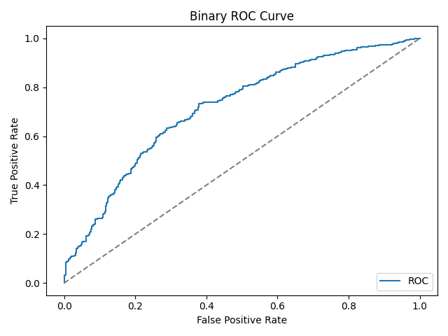
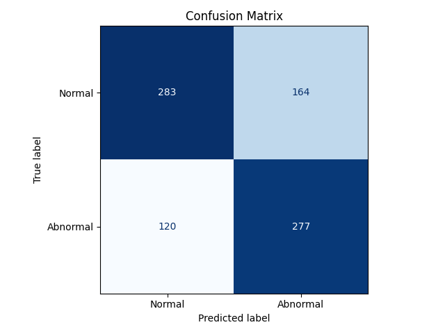
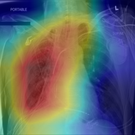
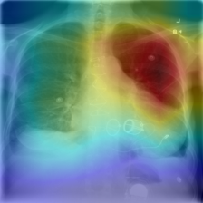
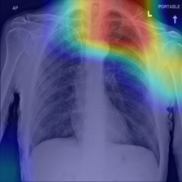
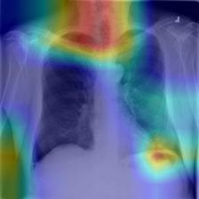

# Chest X-Ray Abnormality Detection Report

## 1. Introduction

Chest radiography is one of the most widely used medical imaging modalities for the initial assessment of thoracic disease. Because chest X-rays are inexpensive and routinely acquired, they are often the first imaging study used to screen for lung abnormalities, infections, pleural findings, and other clinically relevant conditions. However, interpreting these images requires expertise, and in real clinical settings radiologists may need to review large volumes of studies under time pressure. This creates a strong motivation for computer vision systems that can assist human readers by automatically flagging suspicious cases or highlighting potentially relevant image regions.

The problem addressed in this project is **binary chest X-ray abnormality detection**. Instead of attempting full multi-label diagnosis, the task is simplified into a clinically motivated screening setting: each image is classified as either **normal** or **abnormal**. In this repository, the original pathology labels are collapsed into a binary target where `No Finding` is mapped to class `0` and any pathology label is mapped to class `1`. This framing makes the project well-scoped and measurable, which matches the project brief requirement of a clear problem definition with quantitative evaluation.

The main motivation behind the selected formulation is practical. A binary normal-versus-abnormal classifier can act as a first-stage triage model, identifying cases that may deserve closer attention while leaving the final diagnostic decision to medical professionals. The objective is therefore not to replace radiologists, but to build a reproducible and interpretable deep learning pipeline that demonstrates how transfer learning can be applied to a real medical imaging task.

Deep convolutional neural networks have achieved strong performance in image recognition and have been widely adapted to medical imaging applications. Residual networks such as ResNet introduced deep architectures with skip connections that improve optimization stability [2]. DenseNet further extended feature reuse through dense connectivity between layers [3]. In chest X-ray analysis specifically, large public datasets such as the NIH ChestX-ray collection enabled supervised deep learning approaches for disease classification [1]. Interpretability methods also became increasingly important in medical AI, with Grad-CAM providing a way to visualize which regions of an image contributed most strongly to a prediction [5].

Based on this background, the present project uses pretrained convolutional neural networks and evaluates two design choices: backbone architecture and data augmentation. Three experiments were executed:

- `ResNet18` with augmentation
- `ResNet18` without augmentation
- `DenseNet121` with augmentation

The final selected model is chosen according to **validation F1-score**, while additional metrics and visualizations are used for a more complete evaluation.

## 2. Dataset

### 2.1 Data Source and Final Scope

The implementation in this repository uses the local sample layout under `abnormality_detection/data/sample/`, which is derived from the NIH ChestX-ray dataset. Although the original proposal mentioned an additional COVID-19 radiography dataset, the final implementation was intentionally narrowed to a single dataset source in order to maintain a consistent label definition, a reproducible training pipeline, and a manageable experimental scope for the project timeline.

The metadata file actually used by the code is:

`abnormality_detection/data/sample/sample_labels.csv`

The image directory used by the code is:

`abnormality_detection/data/sample/images`

Because the official NIH split files were not present for this sample layout, the code automatically generated a **patient-level** train/validation/test split. This is important because it reduces leakage between splits by preventing images from the same patient from appearing in both training and evaluation sets.

### 2.2 Label Definition

The original dataset contains multiple pathology labels. For this project, these labels were collapsed into a binary target:

- `0`: normal (`No Finding`)
- `1`: abnormal (any pathology label)

This choice matches the project objective of abnormality screening rather than full disease-specific diagnosis. The transformation is implemented directly in `src/dataset.py`:

```python
frame["label"] = (frame["finding_labels"] != "No Finding").astype(int)
```

### 2.3 Dataset Statistics

The dataset used in the final experiments contains **5,606 images** from **4,230 patients**. The overall class balance is moderately skewed but not extreme.

| Split | Samples | Patients | Normal | Abnormal | Abnormal Ratio |
|---|---:|---:|---:|---:|---:|
| Full dataset | 5606 | 4230 | 3044 | 2562 | 45.70% |
| Train | 4012 | 3055 | 2185 | 1827 | 45.54% |
| Validation | 750 | 540 | 412 | 338 | 45.07% |
| Test | 844 | 635 | 447 | 397 | 47.04% |

These statistics show that the split remains reasonably consistent across subsets, which is desirable for stable evaluation.

### 2.4 Preprocessing

All images are resized to `224 x 224`, which matches the expected input resolution for the pretrained backbones used in the experiments. The images are converted to RGB and normalized using ImageNet mean and standard deviation:

- Mean: `[0.485, 0.456, 0.406]`
- Standard deviation: `[0.229, 0.224, 0.225]`

For the augmented training condition, the following transformations are applied:

- random horizontal flip with probability `0.5`
- random rotation within `7` degrees

Validation and test images are not augmented. They are only resized, converted to tensors, and normalized. This keeps evaluation deterministic and comparable across runs.

## 3. Methodology

### 3.1 Overall Pipeline

The repository implements a complete supervised learning pipeline for binary classification:

1. Load metadata and construct binary labels
2. Create patient-level train/validation/test splits
3. Build PyTorch datasets and dataloaders
4. Initialize a pretrained CNN backbone
5. Fine-tune the model using a weighted binary classification loss
6. Evaluate on the validation set after each epoch
7. Save checkpoints, metrics, ROC curves, and confusion matrices
8. Select the best checkpoint using validation F1-score
9. Evaluate the selected model on train, validation, and test splits
10. Generate Grad-CAM visualizations for qualitative interpretation

This structure satisfies the project brief requirement of a real training and evaluation pipeline with quantitative metrics and result visualizations.

### 3.2 Architectures

Two pretrained convolutional backbones are implemented in `src/model.py`:

- `ResNet18`
- `DenseNet121`

Both models are loaded from `torchvision` with pretrained ImageNet weights enabled. Their final classification layers are replaced with a lightweight binary head composed of:

- dropout with probability `0.2`
- a linear layer producing a single logit

This design keeps most of the pretrained representation intact while adapting the last layer to the binary abnormality detection task.

### 3.3 Loss Function and Optimization

The training objective is `BCEWithLogitsLoss`, which combines a sigmoid layer and binary cross-entropy in a numerically stable form. Because the training set is slightly imbalanced, the code computes a positive class weight:

`pos_weight = negatives / positives = 2185 / 1827 ≈ 1.196`

This class weight increases the contribution of abnormal samples in the loss and helps reduce bias toward the majority class.

Optimization is performed with the `Adam` optimizer [4] using:

- learning rate: `1e-4`
- weight decay: `1e-4`

These values are reasonable defaults for transfer learning with pretrained CNNs, where smaller learning rates are generally preferred to avoid destabilizing the pretrained feature extractor.

### 3.4 Training Configuration

The common configuration used across experiments is:

- image size: `224`
- batch size: `8`
- maximum epochs: `5`
- dropout: `0.2`
- decision threshold: `0.5`
- early stopping patience: `3`
- random seed: `42`
- device: automatic CPU/GPU selection

The only intentional differences between runs are the backbone choice and whether augmentation is enabled.

### 3.5 Model Selection and Saved Artifacts

After each epoch, the model is evaluated on the validation set and the following metrics are computed:

- accuracy
- precision
- recall
- F1-score
- ROC-AUC
- confusion matrix

The project uses **validation F1-score** as the model-selection criterion. This is a defensible choice because the dataset is not perfectly balanced, and F1-score captures the tradeoff between precision and recall better than accuracy alone.

The training code saves:

- `*_best.pt`: best validation checkpoint
- `*_last.pt`: last training checkpoint
- `*_history.json`: epoch-by-epoch training loss and validation metrics
- per-epoch validation metrics and figures
- final train/validation/test metrics and summary figures

This makes the experiments reproducible and provides a clear record for analysis.

### 3.6 Interpretability with Grad-CAM

For qualitative interpretation, the selected final model is analyzed using Grad-CAM [5]. The implementation hooks the final convolutional block of the backbone, computes gradient-weighted activation maps, and overlays them on the original X-ray images. In the final run, eight Grad-CAM examples were generated from the test set and saved in:

`abnormality_detection/outputs/figures/gradcam/`

Grad-CAM does not prove clinical correctness, but it provides useful evidence about whether the model is attending to meaningful thoracic regions rather than irrelevant artifacts.

## 4. Experiments

### 4.1 Experimental Design

Three experiments were run to evaluate two design choices:

1. **Baseline:** `ResNet18` with augmentation
2. **Ablation:** `ResNet18` without augmentation
3. **Backbone comparison:** `DenseNet121` with augmentation

The aim of the ablation is to isolate the effect of augmentation, while the backbone comparison tests whether a denser architecture improves performance under the same general pipeline.

### 4.2 Baseline Epoch-by-Epoch Behavior

The baseline `ResNet18 + augmentation` run completed all five epochs and produced the following validation trajectory:

| Epoch | Train Loss | Val Accuracy | Val Precision | Val Recall | Val F1 | Val ROC-AUC |
|---|---:|---:|---:|---:|---:|---:|
| 1 | 0.7320 | 0.6320 | 0.5799 | 0.6657 | 0.6198 | 0.6854 |
| 2 | 0.6856 | 0.7080 | 0.7102 | 0.5947 | 0.6473 | 0.7421 |
| 3 | 0.6650 | 0.6507 | 0.5884 | 0.7485 | 0.6589 | 0.7311 |
| 4 | 0.6573 | 0.6960 | 0.6432 | 0.7308 | 0.6842 | 0.7328 |
| 5 | 0.6435 | 0.7040 | 0.6768 | 0.6568 | 0.6667 | 0.7411 |

Training loss decreases steadily, while validation F1-score peaks at **epoch 4**. Although epoch 5 achieves slightly higher validation accuracy and ROC-AUC, the project selects epoch 4 because validation F1-score is the predefined model-selection criterion.

### 4.3 Final Comparison of the Three Runs

| Run | Backbone | Augmentation | Best Epoch | Val Acc | Val Prec | Val Recall | Val F1 | Val ROC-AUC | Test Acc | Test Prec | Test Recall | Test F1 | Test ROC-AUC |
|---|---|---|---:|---:|---:|---:|---:|---:|---:|---:|---:|---:|---:|
| Baseline | ResNet18 | Yes | 4 | 0.6960 | 0.6432 | 0.7308 | 0.6842 | 0.7328 | 0.6635 | 0.6281 | 0.6977 | 0.6611 | 0.7159 |
| Ablation | ResNet18 | No | 3 | 0.6773 | 0.6171 | 0.7485 | 0.6765 | 0.7465 | 0.6588 | 0.6138 | 0.7406 | 0.6712 | 0.7088 |
| Comparison | DenseNet121 | Yes | 1 | 0.6853 | 0.6433 | 0.6775 | 0.6599 | 0.7317 | 0.6836 | 0.6693 | 0.6474 | 0.6581 | 0.7149 |

### 4.4 Interpretation of Quantitative Results

The baseline `ResNet18 + augmentation` achieved the highest **validation F1-score** among the three runs, which is why it was selected as the final model. Its best checkpoint was obtained at epoch 4, and its test-set F1-score was `0.6611` with a test ROC-AUC of `0.7159`.

The `ResNet18 + no augmentation` run provides a useful ablation result. It learned faster on the training set and reached a lower final training loss, but its validation behavior is less stable. It peaked at epoch 3 and then declined noticeably, which is consistent with overfitting. Interestingly, this run achieved a slightly higher test F1-score (`0.6712`) but a lower test ROC-AUC (`0.7088`) and a lower validation F1-score than the augmented baseline. Since model selection was intentionally based on validation F1-score, the augmented baseline remains the correct final choice.

The `DenseNet121 + augmentation` run did not outperform the ResNet baseline. Its best validation F1-score (`0.6599`) occurred at epoch 1, after which improvement stalled. Because early stopping patience was set to `3`, training terminated after epoch 4. This suggests that the denser architecture did not provide an advantage under the current data size and training budget.

### 4.5 Visual Results

The repository contains multiple figure sets:

- per-epoch validation ROC curves and confusion matrices in `abnormality_detection/outputs/figures/per_epoch/`
- final train/validation/test summary figures in `abnormality_detection/outputs/figures/`
- Grad-CAM examples in `abnormality_detection/outputs/figures/gradcam/`

Suggested report figures for the final selected model are shown below.

**Test ROC curve for the selected baseline model**



**Test confusion matrix for the selected baseline model**



### 4.6 Grad-CAM Examples

Four Grad-CAM examples were selected to show both strengths and limitations of the final model:

- `00000013_005_label1_pred1_p0.759.png`: correct abnormal prediction
- `00000096_006_label1_pred1_p0.800.png`: correct abnormal prediction
- `00000042_002_label0_pred0_p0.304.png`: correct normal prediction
- `00000030_001_label1_pred0_p0.496.png`: false negative case

These examples can be included directly in the report:









The two correct positive examples show that the model can identify image regions associated with abnormal findings and assign a strong abnormal score. The correct negative example is useful because it shows that the model does not simply activate strongly for every image. The false negative case is especially important: its predicted probability (`0.496`) is close to the threshold of `0.5`, which indicates uncertainty. This failure case shows that subtle abnormalities can still be missed, an important limitation in any medical screening setting.

## 5. Discussion

Several conclusions emerge from the experiments.

First, the pipeline itself worked reliably. The repository supports reproducible training, checkpointing, metric export, figure generation, and Grad-CAM visualization. The design is modular, with separate files for configuration, dataset preparation, training, evaluation, model definition, and interpretability. This directly supports the implementation-quality criterion in the grading rubric.

Second, **data augmentation was beneficial overall**. The augmented ResNet18 run produced the best validation F1-score and more stable validation behavior across epochs. By contrast, the no-augmentation run fit the training data more aggressively, as seen by its lower training loss and higher training metrics, but it also showed a sharper decline in validation performance after its best epoch. This is a classic indication of overfitting.

Third, **DenseNet121 did not outperform ResNet18 in this setting**. A more complex architecture does not automatically produce better results, especially when the dataset size is limited and the number of fine-tuning epochs is small. The experiments therefore support the pragmatic conclusion that `ResNet18 + augmentation` is the strongest tradeoff among the tested options.

Despite these strengths, the project has important limitations:

- The task is binary rather than multi-label, so disease-specific diagnostic detail is lost.
- The dataset is a local sample subset rather than the full NIH collection.
- The classification threshold is fixed at `0.5` and was not tuned on the validation set.
- The final system can still miss abnormal cases, as shown by the false negative Grad-CAM example.
- The report compares only a small number of hyperparameter choices; broader sweeps could improve results.

These limitations are important to acknowledge because the project brief explicitly rewards honest evaluation and clear understanding of the system's limits. In medical imaging, false negatives are particularly concerning, since missed abnormalities can have direct clinical consequences. For that reason, future work should consider threshold tuning, stronger augmentation, more extensive hyperparameter search, or reformulating the task as multi-label pathology prediction rather than binary screening.

## 6. Conclusion

This project implemented a complete deep learning pipeline for binary chest X-ray abnormality detection using transfer learning and Grad-CAM-based interpretation. The repository supports dataset preparation, training, validation, test evaluation, checkpoint saving, figure generation, and qualitative inspection of model attention.

Three experiments were performed to study the effect of augmentation and architecture choice. The final selected model was **ResNet18 with augmentation**, chosen because it achieved the highest validation F1-score (`0.6842`) at epoch `4`. Its final test performance was:

- accuracy: `0.6635`
- precision: `0.6281`
- recall: `0.6977`
- F1-score: `0.6611`
- ROC-AUC: `0.7159`

The ablation results showed that removing augmentation led to faster fitting but also stronger overfitting. The backbone comparison showed that DenseNet121 did not outperform the ResNet18 baseline under the current setup. Grad-CAM visualizations provided a qualitative complement to the quantitative metrics by showing both correct model behavior and meaningful failure cases.

Overall, the project meets the main objectives of the course brief: it defines a specific computer vision problem, implements a sound and reproducible technical approach, evaluates the system quantitatively, compares design choices experimentally, and presents visual evidence of how the model behaves. Future improvements could include threshold optimization, larger-scale training on the full NIH dataset, multi-label pathology prediction, and more systematic hyperparameter tuning.

## 7. References

[1] X. Wang, Y. Peng, L. Lu, Z. Lu, M. Bagheri, and R. M. Summers, "ChestX-ray8: Hospital-Scale Chest X-Ray Database and Benchmarks on Weakly Supervised Classification and Localization of Common Thorax Diseases," *CVPR*, 2017.

[2] K. He, X. Zhang, S. Ren, and J. Sun, "Deep Residual Learning for Image Recognition," *CVPR*, 2016.

[3] G. Huang, Z. Liu, L. van der Maaten, and K. Q. Weinberger, "Densely Connected Convolutional Networks," *CVPR*, 2017.

[4] D. P. Kingma and J. Ba, "Adam: A Method for Stochastic Optimization," *ICLR*, 2015.

[5] R. R. Selvaraju, M. Cogswell, A. Das, R. Vedantam, D. Parikh, and D. Batra, "Grad-CAM: Visual Explanations from Deep Networks via Gradient-Based Localization," *ICCV*, 2017.

[6] J. Deng, W. Dong, R. Socher, L. J. Li, K. Li, and L. Fei-Fei, "ImageNet: A Large-Scale Hierarchical Image Database," *CVPR*, 2009.
